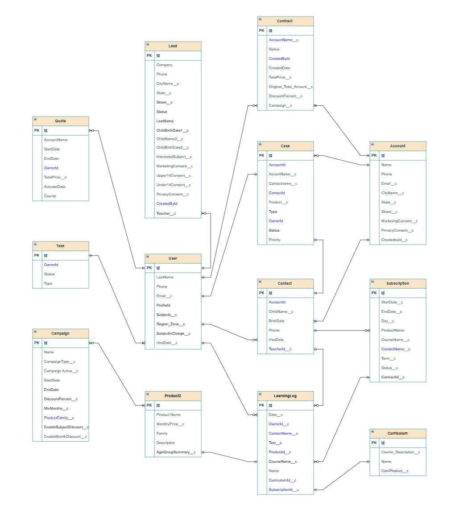

# Salesforce CRM 실전 프로젝트

<p>
  
</p>

## 📅 프로젝트 기간

2024년 6월 13일 ~ 2024년 7월 31일

---

## 📌 프로젝트 개요

본 프로젝트는 가상의 교육 기업 **커몬학습**을 대상으로,  
**Salesforce CRM 플랫폼**을 활용하여 기존의 고객 문의 처리 방식이 가진 한계를 개선하고,  
리드/케이스 수집부터 현장 서비스까지의 프로세스를 통합·자동화하는 실전 프로젝트입니다.

### 💡 주요 목적

- 비표준화된 문의 접수와 수작업 대응 프로세스를 **Web-to-Lead / Web-to-Case**로 개선
- Salesforce의 **LWC, Apex, Service Cloud, Field Service**를 기반으로 CRM 기능 확장
---

## 🗂 ERD (Entity Relationship Diagram)

<p align="center">
  
</p>

---

## 📁 폴더 구조 및 역할

```
├── webtolead
│   └── Salesforce Web-to-Lead용 HTML 폼
│
├── webtocase
│   └── Salesforce Web-to-Case용 HTML 폼
│
└── common
    └── Salesforce DX (SFDX)로 생성한 LWC 프로젝트 (Lightning Web Components 소스)
```

### 📂 webtolead

- 고객이 직접 리드(Lead)를 생성할 수 있는 HTML 폼
- Salesforce Web-to-Lead 기능과 연동

### 📂 webtocase

- 고객이 직접 케이스(Case)를 생성할 수 있는 HTML 폼
- Salesforce Web-to-Case 기능과 연동

### 📂 common

- `sfdx force:project:create` 명령어로 생성한 Salesforce DX 프로젝트
- Lightning Web Components (LWC) 개발 및 Salesforce Org 배포용
- Apex 클래스, LWC 컴포넌트, 메타데이터 포함

---

## ⚙️ 개발 및 배포 환경

| 구분         | 사용 기술/환경                            |
|--------------|-------------------------------------------|
| CRM          | Salesforce Sales Cloud                    |
| 웹 호스팅    | Vercel (정적 HTML 파일 배포)              |
| 개발 도구    | Salesforce CLI (SFDX), Visual Studio Code |
| 프론트엔드   | HTML, CSS, JavaScript, LWC            |
| 백엔드  | Apex, SOQL, Triggers                  |

---

## 📌 주의사항

- Web-to-Lead 및 Web-to-Case는 Salesforce 퍼블릭 사이트 권한 설정이 필요합니다.
- LWC 컴포넌트는 Salesforce 내부에서만 작동합니다 (Experience Cloud, Lightning Pages 등).
- Salesforce Org에 배포 시 API 버전 및 권한 설정 확인이 필요합니다.

---

## ✏️ 프로젝트 목표

✅ Salesforce Web-to-Lead & Web-to-Case 자동화 이해  
✅ Lightning Web Components (LWC) 개발 및 배포  
✅ 고객 문의/상담 프로세스의 자동화 구현  
✅ Salesforce CRM 실무 적용 경험 축적

---
